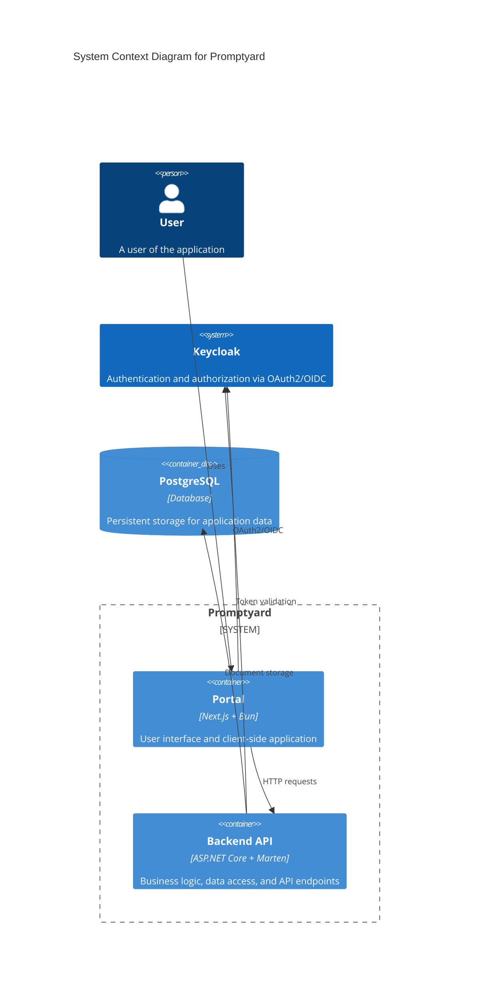

# Context and scope

This section covers the context and scope of the application.

## Business context

TODO: Describe the business context

## Technical context

The following diagram shows the technical context of the system:

| Component   | Technology               | Responsibility                                   |
| ----------- | ------------------------ | ------------------------------------------------ |
| PostgreSQL  | PostgreSQL database      | Persistent storage for application data          |
| Keycloak    | Keycloak identity server | Authentication and authorization via OAuth2/OIDC |
| Backend API | ASP.NET Core + Marten    | Business logic, data access, and API endpoints   |
| Portal      | Next.js + Bun            | User interface and client-side application       |