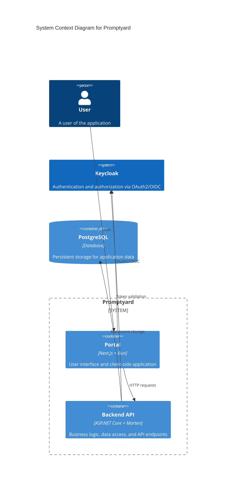

# Building block view

This section covers the static building blocks of the application.
We take a top-down approach, zooming in level after level into each part of the
solution starting at the technical context.

## Technical context

The following diagram shows the top-level technical architecture of the system:

| Component   | Technology               | Responsibility                                   |
| ----------- | ------------------------ | ------------------------------------------------ |
| PostgreSQL  | PostgreSQL database      | Persistent storage for application data          |
| Keycloak    | Keycloak identity server | Authentication and authorization via OAuth2/OIDC |
| Backend API | ASP.NET Core + Marten    | Business logic, data access, and API endpoints   |
| Portal      | Next.js + Bun            | User interface and client-side application       |

### Component relationships

- **Portal → API**: The portal sends HTTP requests to the backend API to create, read, update, and delete content on behalf of the user.
- **Portal → Keycloak**: The portal uses Keycloak for user authentication via OAuth2/OIDC. Users sign in through Keycloak and receive tokens for API access.
- **API → PostgreSQL**: The API uses Marten as a document database layer on top of PostgreSQL to store and retrieve application data.
- **API → Keycloak**: The API validates authentication tokens issued by Keycloak to authorize incoming requests.

## Backend API

The key responsibility for the backend API is store the content created by the
users of the application. It's build in ASP.NET Core with Marten as a document
database layer on top of PostgreSQL. We use WolverineFX to implement the request
handlers in the application.

### Vertical slice architecture

The backend API uses vertical slice architecture to implement functional slices.
The vertical slices make it easier for us to extend functionality as we add more
features to the application.

The application has an `Application` directory that contains sub directories
for each feature group. We've identified the following feature groups:

- Users: Manages everything related to the user aggregate
- Repositories: Manages everything related to the repository aggregate
- Prompts: Manages everything related to the prompt aggregate
- Skills: Manages everything related to the skill aggregate
- Agents: Manages everything related to the agent aggregate

In each feature group we create a single file per feature slice. For example:
The user repository onboarding workflow is located in `Application/Repositories/OnboardUserRepository.cs`.

A vertical slice contains at least these components:

- A command `OnboardUserRepository`
- A response `UserRepositoryDetails`
- The endpoint `OnboardUserRepositoryEndpoint`
- One or more events, for example: `UserRepositoryOnboarded`
- A validator for the input `OnboardUserRepositoryValidator` using fluent
  validation: https://wolverinefx.net/guide/http/validation.html#fluent-validation-middleware

### Event sourcing

We use event sourcing to make it easier for us to reason about business logic
in terms of actions and events that happen as a consequence. We apply event
projections to provide convenient read models for the portal to render data.

We use domain aggregates to help us reason about incoming operations. Domain aggregates
are part of the feature group directories in the application.

## Portal

The portal is repsonsible for rendering the data stored in the backend and for
sending requests on behalf of the user to modify or create content. The portal
is implemented as Next.js application with shadcn components for the user
interface.

## Keycloak

We use keycloak as the authorization server for the project for the time being.
We plan on moving towards EntraID or add EntraID as a federated user provider.